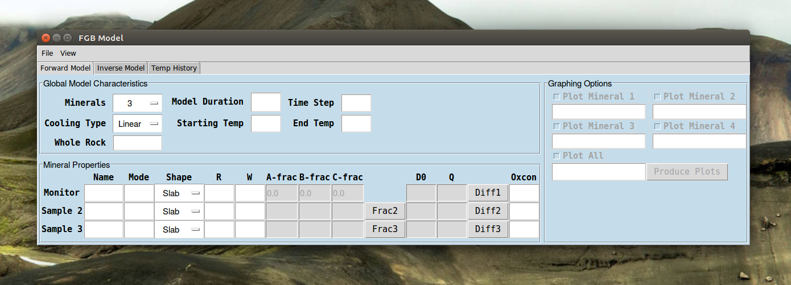

# Oxygen Isotope Diffusion Solver

This python code solves the Fast Grain Boundary (FGB) model for isotope diffusion. It provides a GUI interface for inputing all mineral parameters and provides several graphing options along with the option to export the model solution data to a .csv file. Search menus are provided for convenient referencing of diffusion parameters and fractionation factors.

## Getting Started

These instructions will get you a copy of the project up and running on your local machine and walk you through an example set up of the model parameters.  

### Prerequisites

For this code to run you will need to have python 3 installed on your computer along with the following packages for it: tkinter, numpy, and matplotlib. A brief tutorial for installing python on various operating systems can be found on the wiki page: https://en.wikibooks.org/wiki/A_Beginner%27s_Python_Tutorial/Installing_Python.

### Installing & Running

First download the files DiffusionSolver.py, FractionationFactorsR.csv, and ODiffusionR.csv. Make sure to place all files in the same folder. Additionally, you can download FGB_03S1T1_Params.txt as it contains an example of saved model parameters and will allow you to check that the code is running correctly.

Next we need to open a live terminal and navigate to the folder containing DiffusionSolver.py. On Mac and Linux this is done by simply typing in 'Terminal" into the application search bar. On windows search for 'cmd.' The command cd can be used to change your current folder and ls (Linux, Mac) or dir (Windows) can be used to list the available subfolders to navigate to. Once your in the folder containing DiffusionSolver.py run the code by using the commmand python3, as this will ensure the code is run with the appropriate version.

```
usr>: cd Documents
usr>/Documents: cd OxygenDiffusionSolver
usr>/Documents/OxygenDiffusionSolver: python3 DiffusionSolver.py
```
This should open the following pop-up:


### Inputing Model Parameters

After the GUI popups we will need to input both the general model parameters and the mineral-specific parameters. Most of these are fairly self explanatory. First we will set the number of minerals to four, the current version allows for any number between two and eight. Next, we will select a linear cooling type; this creates a cooling history where temperature is proportional to time. With this we will need to specify the starting and ending temperatures, and the time duration of this cooling. There is also an inverse cooling option (temperature inveresly proportional to time), and a custom option. The custom option will ask for a comma-delimited text file containing times in the first column and cooling rates for that corresponding length of time in the second column. All times are in millions of years, and all temperatures are in Kelvin. We will also need to specify the crushed whole rock delta-18O of our sample. If at any point you are unclear of the units or meaning of a button/entry, simply hover over it with your mouse and a tool-tip should pop up with a brief explanation.

After putting in the general model parameters you should have the following screen:


